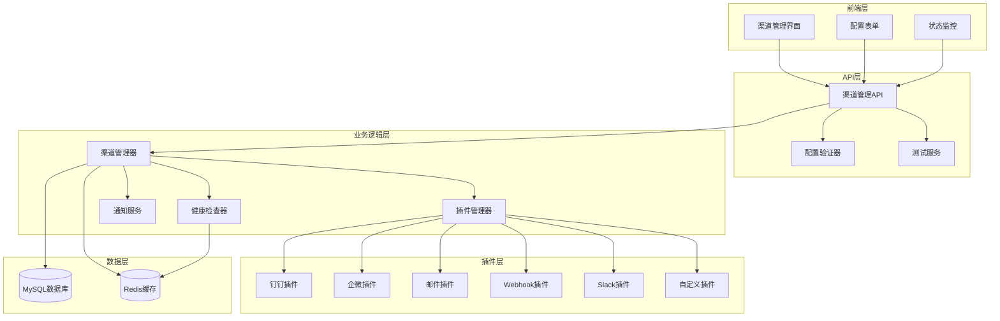

# 告警渠道管理设计文档

## 概述

告警渠道管理系统采用插件化架构设计，支持多种告警渠道类型的统一管理。系统包含前端管理界面、后端API服务、插件管理器和数据存储层，提供完整的渠道生命周期管理功能。

## 架构设计

### 整体架构图



## 组件设计

### 1. 数据模型设计

#### 1.1 告警渠道表 (alert_channels)

```sql
CREATE TABLE alert_channels (
    id VARCHAR(36) PRIMARY KEY,
    name VARCHAR(100) NOT NULL,
    type VARCHAR(50) NOT NULL,
    description TEXT,
    config JSON NOT NULL,
    group_id VARCHAR(36),
    tags JSON,
    status ENUM('active', 'inactive', 'error') DEFAULT 'active',
    health_status ENUM('healthy', 'unhealthy', 'unknown') DEFAULT 'unknown',
    last_health_check TIMESTAMP NULL,
    health_error_message TEXT,
    created_by VARCHAR(36),
    created_at TIMESTAMP DEFAULT CURRENT_TIMESTAMP,
    updated_at TIMESTAMP DEFAULT CURRENT_TIMESTAMP ON UPDATE CURRENT_TIMESTAMP,
    INDEX idx_type (type),
    INDEX idx_status (status),
    INDEX idx_group_id (group_id),
    INDEX idx_created_by (created_by)
);
```

#### 1.2 渠道分组表 (channel_groups)

```sql
CREATE TABLE channel_groups (
    id VARCHAR(36) PRIMARY KEY,
    name VARCHAR(100) NOT NULL UNIQUE,
    description TEXT,
    parent_id VARCHAR(36),
    created_at TIMESTAMP DEFAULT CURRENT_TIMESTAMP,
    updated_at TIMESTAMP DEFAULT CURRENT_TIMESTAMP ON UPDATE CURRENT_TIMESTAMP,
    FOREIGN KEY (parent_id) REFERENCES channel_groups(id) ON DELETE SET NULL,
    INDEX idx_parent_id (parent_id)
);
```

#### 1.3 渠道模板表 (channel_templates)

```sql
CREATE TABLE channel_templates (
    id VARCHAR(36) PRIMARY KEY,
    name VARCHAR(100) NOT NULL,
    type VARCHAR(50) NOT NULL,
    description TEXT,
    config_template JSON NOT NULL,
    created_by VARCHAR(36),
    created_at TIMESTAMP DEFAULT CURRENT_TIMESTAMP,
    updated_at TIMESTAMP DEFAULT CURRENT_TIMESTAMP ON UPDATE CURRENT_TIMESTAMP,
    INDEX idx_type (type),
    INDEX idx_created_by (created_by)
);
```

#### 1.4 渠道使用统计表 (channel_usage_stats)

```sql
CREATE TABLE channel_usage_stats (
    id VARCHAR(36) PRIMARY KEY,
    channel_id VARCHAR(36) NOT NULL,
    date DATE NOT NULL,
    total_messages INT DEFAULT 0,
    success_messages INT DEFAULT 0,
    failed_messages INT DEFAULT 0,
    avg_response_time INT DEFAULT 0,
    created_at TIMESTAMP DEFAULT CURRENT_TIMESTAMP,
    updated_at TIMESTAMP DEFAULT CURRENT_TIMESTAMP ON UPDATE CURRENT_TIMESTAMP,
    FOREIGN KEY (channel_id) REFERENCES alert_channels(id) ON DELETE CASCADE,
    UNIQUE KEY uk_channel_date (channel_id, date),
    INDEX idx_date (date)
);
```

#### 1.5 渠道权限表 (channel_permissions)

```sql
CREATE TABLE channel_permissions (
    id VARCHAR(36) PRIMARY KEY,
    user_id VARCHAR(36) NOT NULL,
    channel_id VARCHAR(36) NOT NULL,
    permission ENUM('read', 'write', 'admin') NOT NULL,
    granted_by VARCHAR(36),
    granted_at TIMESTAMP DEFAULT CURRENT_TIMESTAMP,
    FOREIGN KEY (channel_id) REFERENCES alert_channels(id) ON DELETE CASCADE,
    UNIQUE KEY uk_user_channel (user_id, channel_id),
    INDEX idx_user_id (user_id),
    INDEX idx_channel_id (channel_id)
);
```

### 2. 插件架构设计

#### 2.1 插件接口定义

```go
// ChannelPlugin 定义了告警渠道插件的标准接口
type ChannelPlugin interface {
    // GetType 返回插件类型
    GetType() string
    
    // GetName 返回插件名称
    GetName() string
    
    // GetConfigSchema 返回配置表单的JSON Schema
    GetConfigSchema() *ConfigSchema
    
    // ValidateConfig 验证配置是否有效
    ValidateConfig(config map[string]interface{}) error
    
    // TestConnection 测试连接
    TestConnection(config map[string]interface{}) error
    
    // SendMessage 发送消息
    SendMessage(config map[string]interface{}, message *Message) error
    
    // GetHealthStatus 获取健康状态
    GetHealthStatus(config map[string]interface{}) (*HealthStatus, error)
}

// ConfigSchema 配置表单结构
type ConfigSchema struct {
    Fields []ConfigField `json:"fields"`
}

type ConfigField struct {
    Name        string      `json:"name"`
    Type        string      `json:"type"` // text, password, number, select, textarea
    Label       string      `json:"label"`
    Required    bool        `json:"required"`
    Default     interface{} `json:"default,omitempty"`
    Options     []Option    `json:"options,omitempty"` // for select type
    Validation  *Validation `json:"validation,omitempty"`
    Description string      `json:"description,omitempty"`
}

type Option struct {
    Label string `json:"label"`
    Value string `json:"value"`
}

type Validation struct {
    Pattern string `json:"pattern,omitempty"`
    Min     int    `json:"min,omitempty"`
    Max     int    `json:"max,omitempty"`
    Message string `json:"message,omitempty"`
}

// Message 消息结构
type Message struct {
    Title     string            `json:"title"`
    Content   string            `json:"content"`
    Level     string            `json:"level"` // info, warning, error, critical
    Timestamp time.Time         `json:"timestamp"`
    Labels    map[string]string `json:"labels"`
    Extra     map[string]interface{} `json:"extra,omitempty"`
}

// HealthStatus 健康状态
type HealthStatus struct {
    Status      string    `json:"status"` // healthy, unhealthy, unknown
    Message     string    `json:"message,omitempty"`
    LastCheck   time.Time `json:"last_check"`
    ResponseTime int64    `json:"response_time"` // milliseconds
}
```

#### 2.2 插件管理器

```go
type PluginManager struct {
    plugins map[string]ChannelPlugin
    mutex   sync.RWMutex
}

func NewPluginManager() *PluginManager {
    pm := &PluginManager{
        plugins: make(map[string]ChannelPlugin),
    }
    
    // 注册内置插件
    pm.RegisterPlugin(&DingTalkPlugin{})
    pm.RegisterPlugin(&WeChatPlugin{})
    pm.RegisterPlugin(&EmailPlugin{})
    pm.RegisterPlugin(&WebhookPlugin{})
    pm.RegisterPlugin(&SlackPlugin{})
    
    return pm
}

func (pm *PluginManager) RegisterPlugin(plugin ChannelPlugin) error {
    pm.mutex.Lock()
    defer pm.mutex.Unlock()
    
    pluginType := plugin.GetType()
    if _, exists := pm.plugins[pluginType]; exists {
        return fmt.Errorf("plugin type %s already registered", pluginType)
    }
    
    pm.plugins[pluginType] = plugin
    return nil
}

func (pm *PluginManager) GetPlugin(pluginType string) (ChannelPlugin, error) {
    pm.mutex.RLock()
    defer pm.mutex.RUnlock()
    
    plugin, exists := pm.plugins[pluginType]
    if !exists {
        return nil, fmt.Errorf("plugin type %s not found", pluginType)
    }
    
    return plugin, nil
}

func (pm *PluginManager) ListPlugins() []PluginInfo {
    pm.mutex.RLock()
    defer pm.mutex.RUnlock()
    
    var plugins []PluginInfo
    for _, plugin := range pm.plugins {
        plugins = append(plugins, PluginInfo{
            Type: plugin.GetType(),
            Name: plugin.GetName(),
            Schema: plugin.GetConfigSchema(),
        })
    }
    
    return plugins
}
```

### 3. 具体插件实现

#### 3.1 钉钉插件

```go
type DingTalkPlugin struct{}

func (p *DingTalkPlugin) GetType() string {
    return "dingtalk"
}

func (p *DingTalkPlugin) GetName() string {
    return "钉钉"
}

func (p *DingTalkPlugin) GetConfigSchema() *ConfigSchema {
    return &ConfigSchema{
        Fields: []ConfigField{
            {
                Name:        "webhook_url",
                Type:        "text",
                Label:       "Webhook URL",
                Required:    true,
                Description: "钉钉群机器人的Webhook地址",
                Validation: &Validation{
                    Pattern: "^https://oapi\\.dingtalk\\.com/robot/send\\?access_token=.*",
                    Message: "请输入有效的钉钉Webhook URL",
                },
            },
            {
                Name:        "secret",
                Type:        "password",
                Label:       "签名密钥",
                Required:    false,
                Description: "钉钉机器人的签名密钥（可选）",
            },
            {
                Name:        "at_mobiles",
                Type:        "textarea",
                Label:       "@手机号",
                Required:    false,
                Description: "需要@的手机号，每行一个",
            },
            {
                Name:        "at_all",
                Type:        "select",
                Label:       "@所有人",
                Required:    false,
                Default:     "false",
                Options: []Option{
                    {Label: "是", Value: "true"},
                    {Label: "否", Value: "false"},
                },
            },
        },
    }
}

func (p *DingTalkPlugin) ValidateConfig(config map[string]interface{}) error {
    webhookURL, ok := config["webhook_url"].(string)
    if !ok || webhookURL == "" {
        return errors.New("webhook_url is required")
    }
    
    if !strings.HasPrefix(webhookURL, "https://oapi.dingtalk.com/robot/send") {
        return errors.New("invalid dingtalk webhook URL")
    }
    
    return nil
}

func (p *DingTalkPlugin) TestConnection(config map[string]interface{}) error {
    message := &Message{
        Title:     "测试消息",
        Content:   "这是一条来自AlertAgent的测试消息",
        Level:     "info",
        Timestamp: time.Now(),
    }
    
    return p.SendMessage(config, message)
}

func (p *DingTalkPlugin) SendMessage(config map[string]interface{}, message *Message) error {
    webhookURL := config["webhook_url"].(string)
    secret, _ := config["secret"].(string)
    atMobiles, _ := config["at_mobiles"].(string)
    atAll, _ := config["at_all"].(string)
    
    // 构建钉钉消息格式
    dingMessage := map[string]interface{}{
        "msgtype": "markdown",
        "markdown": map[string]interface{}{
            "title": message.Title,
            "text":  p.formatMessage(message),
        },
    }
    
    // 处理@功能
    if atMobiles != "" || atAll == "true" {
        at := make(map[string]interface{})
        
        if atMobiles != "" {
            mobiles := strings.Split(strings.TrimSpace(atMobiles), "\n")
            var validMobiles []string
            for _, mobile := range mobiles {
                mobile = strings.TrimSpace(mobile)
                if mobile != "" {
                    validMobiles = append(validMobiles, mobile)
                }
            }
            at["atMobiles"] = validMobiles
        }
        
        if atAll == "true" {
            at["isAtAll"] = true
        }
        
        dingMessage["at"] = at
    }
    
    // 如果有签名密钥，计算签名
    if secret != "" {
        timestamp := time.Now().UnixNano() / 1e6
        sign := p.calculateSign(timestamp, secret)
        webhookURL = fmt.Sprintf("%s&timestamp=%d&sign=%s", webhookURL, timestamp, sign)
    }
    
    // 发送消息
    return p.sendHTTPRequest(webhookURL, dingMessage)
}

func (p *DingTalkPlugin) GetHealthStatus(config map[string]interface{}) (*HealthStatus, error) {
    start := time.Now()
    err := p.TestConnection(config)
    responseTime := time.Since(start).Milliseconds()
    
    status := &HealthStatus{
        LastCheck:    time.Now(),
        ResponseTime: responseTime,
    }
    
    if err != nil {
        status.Status = "unhealthy"
        status.Message = err.Error()
    } else {
        status.Status = "healthy"
        status.Message = "连接正常"
    }
    
    return status, nil
}

func (p *DingTalkPlugin) formatMessage(message *Message) string {
    var builder strings.Builder
    
    // 标题和级别
    levelEmoji := p.getLevelEmoji(message.Level)
    builder.WriteString(fmt.Sprintf("## %s %s\n\n", levelEmoji, message.Title))
    
    // 内容
    builder.WriteString(fmt.Sprintf("**内容：** %s\n\n", message.Content))
    
    // 时间
    builder.WriteString(fmt.Sprintf("**时间：** %s\n\n", message.Timestamp.Format("2006-01-02 15:04:05")))
    
    // 标签
    if len(message.Labels) > 0 {
        builder.WriteString("**标签：**\n")
        for key, value := range message.Labels {
            builder.WriteString(fmt.Sprintf("- %s: %s\n", key, value))
        }
    }
    
    return builder.String()
}

func (p *DingTalkPlugin) getLevelEmoji(level string) string {
    switch level {
    case "critical":
        return "🔴"
    case "error":
        return "🟠"
    case "warning":
        return "🟡"
    case "info":
        return "🔵"
    default:
        return "ℹ️"
    }
}

func (p *DingTalkPlugin) calculateSign(timestamp int64, secret string) string {
    stringToSign := fmt.Sprintf("%d\n%s", timestamp, secret)
    h := hmac.New(sha256.New, []byte(secret))
    h.Write([]byte(stringToSign))
    return base64.StdEncoding.EncodeToString(h.Sum(nil))
}

func (p *DingTalkPlugin) sendHTTPRequest(url string, data interface{}) error {
    jsonData, err := json.Marshal(data)
    if err != nil {
        return err
    }
    
    resp, err := http.Post(url, "application/json", bytes.NewBuffer(jsonData))
    if err != nil {
        return err
    }
    defer resp.Body.Close()
    
    if resp.StatusCode != http.StatusOK {
        body, _ := ioutil.ReadAll(resp.Body)
        return fmt.Errorf("HTTP %d: %s", resp.StatusCode, string(body))
    }
    
    // 解析钉钉响应
    var result map[string]interface{}
    if err := json.NewDecoder(resp.Body).Decode(&result); err != nil {
        return err
    }
    
    if errCode, ok := result["errcode"].(float64); ok && errCode != 0 {
        errMsg, _ := result["errmsg"].(string)
        return fmt.Errorf("钉钉API错误 %v: %s", errCode, errMsg)
    }
    
    return nil
}
```

#### 3.2 企业微信插件

```go
type WeChatPlugin struct{}

func (p *WeChatPlugin) GetType() string {
    return "wechat"
}

func (p *WeChatPlugin) GetName() string {
    return "企业微信"
}

func (p *WeChatPlugin) GetConfigSchema() *ConfigSchema {
    return &ConfigSchema{
        Fields: []ConfigField{
            {
                Name:        "corp_id",
                Type:        "text",
                Label:       "企业ID",
                Required:    true,
                Description: "企业微信的企业ID",
            },
            {
                Name:        "agent_id",
                Type:        "text",
                Label:       "应用ID",
                Required:    true,
                Description: "企业微信应用的AgentId",
            },
            {
                Name:        "corp_secret",
                Type:        "password",
                Label:       "应用密钥",
                Required:    true,
                Description: "企业微信应用的Secret",
            },
            {
                Name:        "to_user",
                Type:        "text",
                Label:       "接收用户",
                Required:    false,
                Description: "接收消息的用户ID，多个用|分隔，@all表示全部",
                Default:     "@all",
            },
            {
                Name:        "to_party",
                Type:        "text",
                Label:       "接收部门",
                Required:    false,
                Description: "接收消息的部门ID，多个用|分隔",
            },
        },
    }
}

func (p *WeChatPlugin) ValidateConfig(config map[string]interface{}) error {
    requiredFields := []string{"corp_id", "agent_id", "corp_secret"}
    
    for _, field := range requiredFields {
        if value, ok := config[field].(string); !ok || value == "" {
            return fmt.Errorf("%s is required", field)
        }
    }
    
    return nil
}

func (p *WeChatPlugin) TestConnection(config map[string]interface{}) error {
    // 测试获取access_token
    _, err := p.getAccessToken(config)
    if err != nil {
        return fmt.Errorf("获取access_token失败: %v", err)
    }
    
    // 发送测试消息
    message := &Message{
        Title:     "测试消息",
        Content:   "这是一条来自AlertAgent的测试消息",
        Level:     "info",
        Timestamp: time.Now(),
    }
    
    return p.SendMessage(config, message)
}

func (p *WeChatPlugin) SendMessage(config map[string]interface{}, message *Message) error {
    accessToken, err := p.getAccessToken(config)
    if err != nil {
        return err
    }
    
    agentId := config["agent_id"].(string)
    toUser, _ := config["to_user"].(string)
    toParty, _ := config["to_party"].(string)
    
    if toUser == "" {
        toUser = "@all"
    }
    
    // 构建企业微信消息
    wechatMessage := map[string]interface{}{
        "touser":  toUser,
        "toparty": toParty,
        "msgtype": "markdown",
        "agentid": agentId,
        "markdown": map[string]interface{}{
            "content": p.formatMessage(message),
        },
    }
    
    // 发送消息
    url := fmt.Sprintf("https://qyapi.weixin.qq.com/cgi-bin/message/send?access_token=%s", accessToken)
    return p.sendHTTPRequest(url, wechatMessage)
}

func (p *WeChatPlugin) GetHealthStatus(config map[string]interface{}) (*HealthStatus, error) {
    start := time.Now()
    err := p.TestConnection(config)
    responseTime := time.Since(start).Milliseconds()
    
    status := &HealthStatus{
        LastCheck:    time.Now(),
        ResponseTime: responseTime,
    }
    
    if err != nil {
        status.Status = "unhealthy"
        status.Message = err.Error()
    } else {
        status.Status = "healthy"
        status.Message = "连接正常"
    }
    
    return status, nil
}

func (p *WeChatPlugin) getAccessToken(config map[string]interface{}) (string, error) {
    corpId := config["corp_id"].(string)
    corpSecret := config["corp_secret"].(string)
    
    url := fmt.Sprintf("https://qyapi.weixin.qq.com/cgi-bin/gettoken?corpid=%s&corpsecret=%s", corpId, corpSecret)
    
    resp, err := http.Get(url)
    if err != nil {
        return "", err
    }
    defer resp.Body.Close()
    
    var result map[string]interface{}
    if err := json.NewDecoder(resp.Body).Decode(&result); err != nil {
        return "", err
    }
    
    if errCode, ok := result["errcode"].(float64); ok && errCode != 0 {
        errMsg, _ := result["errmsg"].(string)
        return "", fmt.Errorf("企业微信API错误 %v: %s", errCode, errMsg)
    }
    
    accessToken, ok := result["access_token"].(string)
    if !ok {
        return "", errors.New("获取access_token失败")
    }
    
    return accessToken, nil
}

func (p *WeChatPlugin) formatMessage(message *Message) string {
    var builder strings.Builder
    
    // 标题和级别
    levelColor := p.getLevelColor(message.Level)
    builder.WriteString(fmt.Sprintf("## <font color=\"%s\">%s</font>\n\n", levelColor, message.Title))
    
    // 内容
    builder.WriteString(fmt.Sprintf("**内容：** %s\n\n", message.Content))
    
    // 时间
    builder.WriteString(fmt.Sprintf("**时间：** %s\n\n", message.Timestamp.Format("2006-01-02 15:04:05")))
    
    // 标签
    if len(message.Labels) > 0 {
        builder.WriteString("**标签：**\n")
        for key, value := range message.Labels {
            builder.WriteString(fmt.Sprintf("> %s: %s\n", key, value))
        }
    }
    
    return builder.String()
}

func (p *WeChatPlugin) getLevelColor(level string) string {
    switch level {
    case "critical":
        return "warning" // 红色
    case "error":
        return "warning" // 红色
    case "warning":
        return "comment" // 黄色
    case "info":
        return "info"    // 蓝色
    default:
        return "comment"
    }
}

func (p *WeChatPlugin) sendHTTPRequest(url string, data interface{}) error {
    jsonData, err := json.Marshal(data)
    if err != nil {
        return err
    }
    
    resp, err := http.Post(url, "application/json", bytes.NewBuffer(jsonData))
    if err != nil {
        return err
    }
    defer resp.Body.Close()
    
    var result map[string]interface{}
    if err := json.NewDecoder(resp.Body).Decode(&result); err != nil {
        return err
    }
    
    if errCode, ok := result["errcode"].(float64); ok && errCode != 0 {
        errMsg, _ := result["errmsg"].(string)
        return fmt.Errorf("企业微信API错误 %v: %s", errCode, errMsg)
    }
    
    return nil
}
```

### 4. 渠道管理服务

```go
type ChannelService struct {
    db            *gorm.DB
    redis         *redis.Client
    pluginManager *PluginManager
    healthChecker *HealthChecker
}

func NewChannelService(db *gorm.DB, redis *redis.Client) *ChannelService {
    return &ChannelService{
        db:            db,
        redis:         redis,
        pluginManager: NewPluginManager(),
        healthChecker: NewHealthChecker(),
    }
}

// CreateChannel 创建告警渠道
func (s *ChannelService) CreateChannel(req *CreateChannelRequest) (*Channel, error) {
    // 验证插件类型
    plugin, err := s.pluginManager.GetPlugin(req.Type)
    if err != nil {
        return nil, fmt.Errorf("不支持的渠道类型: %s", req.Type)
    }
    
    // 验证配置
    if err := plugin.ValidateConfig(req.Config); err != nil {
        return nil, fmt.Errorf("配置验证失败: %v", err)
    }
    
    // 创建渠道记录
    channel := &Channel{
        ID:          uuid.New().String(),
        Name:        req.Name,
        Type:        req.Type,
        Description: req.Description,
        Config:      req.Config,
        GroupID:     req.GroupID,
        Tags:        req.Tags,
        Status:      "active",
        CreatedBy:   req.CreatedBy,
        CreatedAt:   time.Now(),
        UpdatedAt:   time.Now(),
    }
    
    if err := s.db.Create(channel).Error; err != nil {
        return nil, err
    }
    
    // 启动健康检查
    s.healthChecker.AddChannel(channel.ID, channel.Type, channel.Config)
    
    return channel, nil
}

// UpdateChannel 更新告警渠道
func (s *ChannelService) UpdateChannel(id string, req *UpdateChannelRequest) (*Channel, error) {
    var channel Channel
    if err := s.db.First(&channel, "id = ?", id).Error; err != nil {
        return nil, err
    }
    
    // 如果配置有变化，验证新配置
    if req.Config != nil {
        plugin, err := s.pluginManager.GetPlugin(channel.Type)
        if err != nil {
            return nil, err
        }
        
        if err := plugin.ValidateConfig(req.Config); err != nil {
            return nil, fmt.Errorf("配置验证失败: %v", err)
        }
        
        channel.Config = req.Config
    }
    
    // 更新其他字段
    if req.Name != "" {
        channel.Name = req.Name
    }
    if req.Description != "" {
        channel.Description = req.Description
    }
    if req.GroupID != "" {
        channel.GroupID = req.GroupID
    }
    if req.Tags != nil {
        channel.Tags = req.Tags
    }
    if req.Status != "" {
        channel.Status = req.Status
    }
    
    channel.UpdatedAt = time.Now()
    
    if err := s.db.Save(&channel).Error; err != nil {
        return nil, err
    }
    
    // 更新健康检查
    s.healthChecker.UpdateChannel(channel.ID, channel.Type, channel.Config)
    
    return &channel, nil
}

// DeleteChannel 删除告警渠道
func (s *ChannelService) DeleteChannel(id string) error {
    // 检查是否有关联的告警规则
    var count int64
    if err := s.db.Model(&AlertRule{}).Where("JSON_CONTAINS(notification_channels, ?)", fmt.Sprintf(`"%s"`, id)).Count(&count).Error; err != nil {
        return err
    }
    
    if count > 0 {
        return fmt.Errorf("无法删除渠道，存在 %d 个关联的告警规则", count)
    }
    
    // 删除渠道
    if err := s.db.Delete(&Channel{}, "id = ?", id).Error; err != nil {
        return err
    }
    
    // 停止健康检查
    s.healthChecker.RemoveChannel(id)
    
    return nil
}

// TestChannel 测试渠道连接
func (s *ChannelService) TestChannel(id string) error {
    var channel Channel
    if err := s.db.First(&channel, "id = ?", id).Error; err != nil {
        return err
    }
    
    plugin, err := s.pluginManager.GetPlugin(channel.Type)
    if err != nil {
        return err
    }
    
    return plugin.TestConnection(channel.Config)
}

// SendMessage 发送消息
func (s *ChannelService) SendMessage(channelID string, message *Message) error {
    var channel Channel
    if err := s.db.First(&channel, "id = ? AND status = 'active'", channelID).Error; err != nil {
        return err
    }
    
    plugin, err := s.pluginManager.GetPlugin(channel.Type)
    if err != nil {
        return err
    }
    
    start := time.Now()
    err = plugin.SendMessage(channel.Config, message)
    duration := time.Since(start)
    
    // 记录统计信息
    s.recordUsageStats(channelID, err == nil, duration)
    
    return err
}

// GetChannelList 获取渠道列表
func (s *ChannelService) GetChannelList(req *ListChannelRequest) (*ListChannelResponse, error) {
    query := s.db.Model(&Channel{})
    
    // 过滤条件
    if req.Type != "" {
        query = query.Where("type = ?", req.Type)
    }
    if req.GroupID != "" {
        query = query.Where("group_id = ?", req.GroupID)
    }
    if req.Status != "" {
        query = query.Where("status = ?", req.Status)
    }
    if req.Search != "" {
        query = query.Where("name LIKE ? OR description LIKE ?", "%"+req.Search+"%", "%"+req.Search+"%")
    }
    
    // 标签过滤
    if len(req.Tags) > 0 {
        for _, tag := range req.Tags {
            query = query.Where("JSON_CONTAINS(tags, ?)", fmt.Sprintf(`"%s"`, tag))
        }
    }
    
    // 总数
    var total int64
    if err := query.Count(&total).Error; err != nil {
        return nil, err
    }
    
    // 分页
    offset := (req.Page - 1) * req.PageSize
    query = query.Offset(offset).Limit(req.PageSize)
    
    // 排序
    if req.OrderBy != "" {
        query = query.Order(req.OrderBy)
    } else {
        query = query.Order("created_at DESC")
    }
    
    var channels []Channel
    if err := query.Find(&channels).Error; err != nil {
        return nil, err
    }
    
    return &ListChannelResponse{
        Channels: channels,
        Total:    total,
        Page:     req.Page,
        PageSize: req.PageSize,
    }, nil
}

func (s *ChannelService) recordUsageStats(channelID string, success bool, duration time.Duration) {
    date := time.Now().Format("2006-01-02")
    key := fmt.Sprintf("channel_stats:%s:%s", channelID, date)
    
    // 使用Redis记录统计信息
    pipe := s.redis.Pipeline()
    pipe.HIncrBy(key, "total_messages", 1)
    if success {
        pipe.HIncrBy(key, "success_messages", 1)
    } else {
        pipe.HIncrBy(key, "failed_messages", 1)
    }
    
    // 更新平均响应时间
    pipe.HIncrBy(key, "total_response_time", duration.Milliseconds())
    pipe.Expire(key, 30*24*time.Hour) // 保留30天
    
    pipe.Exec()
}
```

## 接口设计

### API 端点

```go
// 渠道管理API
POST   /api/v1/channels                    // 创建渠道
GET    /api/v1/channels                    // 获取渠道列表
GET    /api/v1/channels/{id}               // 获取渠道详情
PUT    /api/v1/channels/{id}               // 更新渠道
DELETE /api/v1/channels/{id}               // 删除渠道
POST   /api/v1/channels/{id}/test          // 测试渠道
POST   /api/v1/channels/{id}/send          // 发送消息

// 插件管理API
GET    /api/v1/plugins                     // 获取插件列表
GET    /api/v1/plugins/{type}/schema       // 获取插件配置表单

// 分组管理API
POST   /api/v1/channel-groups              // 创建分组
GET    /api/v1/channel-groups              // 获取分组列表
PUT    /api/v1/channel-groups/{id}         // 更新分组
DELETE /api/v1/channel-groups/{id}         // 删除分组

// 模板管理API
POST   /api/v1/channel-templates           // 创建模板
GET    /api/v1/channel-templates           // 获取模板列表
PUT    /api/v1/channel-templates/{id}      // 更新模板
DELETE /api/v1/channel-templates/{id}      // 删除模板

// 统计分析API
GET    /api/v1/channels/{id}/stats         // 获取渠道统计
GET    /api/v1/channels/stats/summary      // 获取统计汇总
```

## 前端界面设计

### 1. 渠道列表页面

- 渠道卡片展示（名称、类型、状态、健康状态）
- 搜索和过滤功能
- 批量操作（启用/禁用、删除）
- 分组视图切换

### 2. 渠道创建/编辑页面

- 渠道类型选择
- 动态配置表单（基于插件Schema）
- 配置验证和测试
- 分组和标签管理

### 3. 渠道详情页面

- 基本信息展示
- 健康状态监控
- 使用统计图表
- 操作日志

### 4. 插件管理页面

- 已安装插件列表
- 插件详情和配置
- 插件启用/禁用

## 错误处理

### 错误类型定义

```go
type ChannelError struct {
    Code    string `json:"code"`
    Message string `json:"message"`
    Details string `json:"details,omitempty"`
}

const (
    ErrChannelNotFound     = "CHANNEL_NOT_FOUND"
    ErrChannelConfigInvalid = "CHANNEL_CONFIG_INVALID"
    ErrChannelTestFailed   = "CHANNEL_TEST_FAILED"
    ErrChannelSendFailed   = "CHANNEL_SEND_FAILED"
    ErrPluginNotFound      = "PLUGIN_NOT_FOUND"
    ErrPermissionDenied    = "PERMISSION_DENIED"
)
```

## 安全考虑

1. **配置加密**: 敏感配置信息（如密钥、密码）需要加密存储
2. **权限控制**: 基于角色的访问控制，限制用户操作权限
3. **审计日志**: 记录所有渠道相关的操作日志
4. **输入验证**: 严格验证所有用户输入，防止注入攻击
5. **HTTPS通信**: 所有外部API调用使用HTTPS加密传输

## 性能优化

1. **连接池**: 复用HTTP连接，减少连接开销
2. **异步发送**: 消息发送采用异步处理，提高响应速度
3. **缓存机制**: 缓存插件配置和健康状态信息
4. **批量处理**: 支持批量发送消息，提高吞吐量
5. **限流控制**: 对外部API调用进行限流，避免触发限制