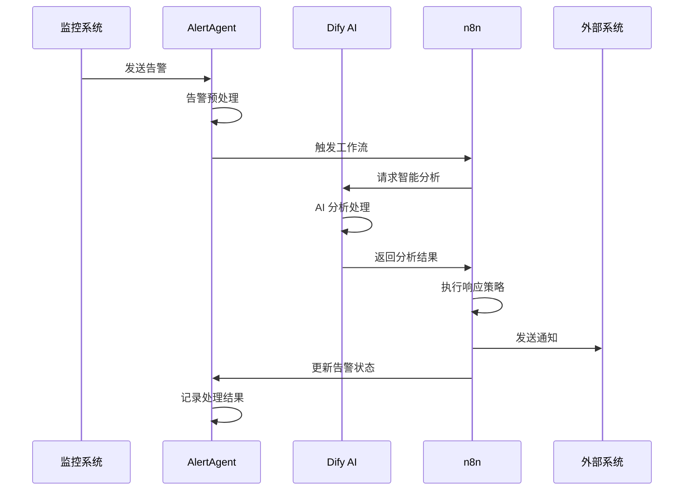

# AlertAgent + n8n + Dify 集成架构设计

> 文档创建时间：2025-01-27
> 作者：SRE团队
> 版本：v1.0

## 概述

本文档详细描述了基于 n8n + Dify 组合方案的 AlertAgent 集成架构设计，旨在构建一个智能化、自动化的告警处理系统。该架构充分发挥了 n8n 的工作流自动化能力和 Dify 的 AI 应用开发优势，为企业级告警管理提供完整的解决方案。

## 架构设计原则

### 1. 分层解耦
- **数据层**：AlertAgent 负责告警数据收集和存储
- **智能层**：Dify 提供 AI 分析和决策能力
- **自动化层**：n8n 执行工作流和系统集成
- **展示层**：统一的 Web 界面和 API 接口

### 2. 高可用性
- 支持多实例部署和负载均衡
- 提供故障转移和数据备份机制
- 实现服务健康检查和自动恢复

### 3. 可扩展性
- 模块化设计，支持独立扩展
- 标准化 API 接口，便于第三方集成
- 支持水平扩展和垂直扩展

## 系统架构图

```
┌─────────────────────────────────────────────────────────────────┐
│                        AlertAgent 生态系统                        │
├─────────────────────────────────────────────────────────────────┤
│  ┌─────────────┐    ┌─────────────┐    ┌─────────────┐          │
│  │ Prometheus  │    │VictoriaMetrics│   │   其他监控   │          │
│  │   告警源    │    │    告警源     │    │    系统     │          │
│  └─────┬───────┘    └─────┬───────┘    └─────┬───────┘          │
│        │                  │                  │                  │
│        └──────────────────┼──────────────────┘                  │
│                           │                                     │
│  ┌─────────────────────────▼─────────────────────────┐          │
│  │              AlertAgent Core                      │          │
│  │  ┌─────────────┐  ┌─────────────┐  ┌─────────────┐ │          │
│  │  │ 告警收集器   │  │ 规则引擎     │  │ 数据存储     │ │          │
│  │  └─────────────┘  └─────────────┘  └─────────────┘ │          │
│  └─────────────────────────┬─────────────────────────┘          │
│                           │                                     │
├───────────────────────────┼─────────────────────────────────────┤
│                           │                                     │
│  ┌─────────────────────────▼─────────────────────────┐          │
│  │                 Dify AI 平台                      │          │
│  │  ┌─────────────┐  ┌─────────────┐  ┌─────────────┐ │          │
│  │  │ 告警分析     │  │ 知识库       │  │ 决策引擎     │ │          │
│  │  │ Agent       │  │ 管理         │  │             │ │          │
│  │  └─────────────┘  └─────────────┘  └─────────────┘ │          │
│  │  ┌─────────────┐  ┌─────────────┐  ┌─────────────┐ │          │
│  │  │ 多模型       │  │ RAG 检索     │  │ 工作流       │ │          │
│  │  │ 支持         │  │ 增强         │  │ 编排         │ │          │
│  │  └─────────────┘  └─────────────┘  └─────────────┘ │          │
│  └─────────────────────────┬─────────────────────────┘          │
│                           │                                     │
│  ┌─────────────────────────▼─────────────────────────┐          │
│  │                n8n 工作流引擎                      │          │
│  │  ┌─────────────┐  ┌─────────────┐  ┌─────────────┐ │          │
│  │  │ 告警处理     │  │ 通知分发     │  │ 系统集成     │ │          │
│  │  │ 工作流       │  │ 工作流       │  │ 工作流       │ │          │
│  │  └─────────────┘  └─────────────┘  └─────────────┘ │          │
│  │  ┌─────────────┐  ┌─────────────┐  ┌─────────────┐ │          │
│  │  │ 自动化       │  │ 数据同步     │  │ 第三方       │ │          │
│  │  │ 响应         │  │ 工作流       │  │ API 集成    │ │          │
│  │  └─────────────┘  └─────────────┘  └─────────────┘ │          │
│  └─────────────────────────┬─────────────────────────┘          │
│                           │                                     │
│  ┌─────────────────────────▼─────────────────────────┐          │
│  │              外部系统集成                          │          │
│  │  ┌─────────────┐  ┌─────────────┐  ┌─────────────┐ │          │
│  │  │ 钉钉/企微    │  │ ITSM 系统   │  │ 监控大屏     │ │          │
│  │  └─────────────┘  └─────────────┘  └─────────────┘ │          │
│  │  ┌─────────────┐  ┌─────────────┐  ┌─────────────┐ │          │
│  │  │ 邮件系统     │  │ 短信平台     │  │ 其他业务     │ │          │
│  │  │             │  │             │  │ 系统         │ │          │
│  │  └─────────────┘  └─────────────┘  └─────────────┘ │          │
│  └─────────────────────────────────────────────────┘          │
└─────────────────────────────────────────────────────────────────┘
```

## 核心组件设计

### 1. AlertAgent Core（告警核心）

#### 1.1 告警收集器
```yaml
功能职责：
  - 接收来自 Prometheus、VictoriaMetrics 等监控系统的告警
  - 标准化告警数据格式
  - 实现告警去重和聚合
  - 提供告警状态管理

技术实现：
  - 基于现有 AlertAgent 架构
  - 支持 Webhook 和 API 接收
  - 使用 Redis 进行告警缓存
  - MySQL 存储告警历史数据
```

#### 1.2 规则引擎
```yaml
功能职责：
  - 告警分级和分类
  - 告警抑制和收敛
  - 路由规则配置
  - 升级策略管理

技术实现：
  - 基于规则表达式引擎
  - 支持动态规则更新
  - 提供规则测试和验证
  - 集成告警依赖关系分析
```

### 2. Dify AI 平台

#### 2.1 告警分析 Agent
```yaml
功能职责：
  - 告警内容智能分析
  - 根因分析和故障诊断
  - 解决方案推荐
  - 影响范围评估

实现方案：
  - 创建专门的告警分析 Agent
  - 集成多种大模型（GPT-4、Claude、DeepSeek）
  - 使用 RAG 技术结合历史告警数据
  - 提供多轮对话式分析
```

#### 2.2 知识库管理
```yaml
功能职责：
  - 运维知识库构建
  - 故障处理手册管理
  - 最佳实践文档
  - 历史案例分析

实现方案：
  - 支持多种文档格式导入
  - 自动化知识提取和索引
  - 向量化存储和检索
  - 知识图谱构建
```

#### 2.3 决策引擎
```yaml
功能职责：
  - 智能决策制定
  - 自动化响应策略
  - 风险评估和控制
  - 处理优先级排序

实现方案：
  - 基于机器学习的决策模型
  - 多因子决策算法
  - 实时风险评估
  - 可解释的决策过程
```

### 3. n8n 工作流引擎

#### 3.1 告警处理工作流
```yaml
工作流类型：
  - 告警接收和预处理
  - 智能分析和诊断
  - 自动化响应执行
  - 结果反馈和记录

节点配置：
  - HTTP Request：调用 AlertAgent API
  - Dify AI：执行智能分析
  - Conditional：条件判断和分支
  - Function：自定义逻辑处理
```

#### 3.2 通知分发工作流
```yaml
工作流类型：
  - 多渠道通知分发
  - 通知内容个性化
  - 通知状态跟踪
  - 升级通知处理

节点配置：
  - 钉钉/企微：即时通讯通知
  - Email：邮件通知
  - SMS：短信通知
  - Webhook：自定义通知
```

#### 3.3 系统集成工作流
```yaml
工作流类型：
  - ITSM 系统集成
  - 监控系统联动
  - 业务系统通知
  - 数据同步处理

节点配置：
  - API 调用节点
  - 数据转换节点
  - 错误处理节点
  - 重试机制节点
```

## 数据流设计

### 1. 告警处理流程



### 2. 数据存储策略

```yaml
AlertAgent 数据存储：
  - MySQL：告警数据、规则配置、用户信息
  - Redis：告警缓存、会话状态、实时数据
  - InfluxDB：时序数据、性能指标（可选）

Dify 数据存储：
  - 向量数据库：知识库向量化数据
  - PostgreSQL：应用配置、对话历史
  - 对象存储：文档文件、模型缓存

n8n 数据存储：
  - PostgreSQL：工作流定义、执行历史
  - Redis：任务队列、临时数据
  - 文件系统：工作流备份、日志文件
```

## API 接口设计

### 1. AlertAgent API 扩展

```yaml
# 新增 AI 集成接口
POST /api/v1/ai/analyze
  描述: 请求 AI 分析告警
  参数:
    - alert_id: 告警ID
    - analysis_type: 分析类型
  返回: 分析结果和建议

POST /api/v1/workflow/trigger
  描述: 触发 n8n 工作流
  参数:
    - workflow_id: 工作流ID
    - alert_data: 告警数据
  返回: 工作流执行状态

GET /api/v1/knowledge/search
  描述: 搜索知识库
  参数:
    - query: 搜索关键词
    - category: 知识分类
  返回: 相关知识条目
```

### 2. Dify 集成接口

```yaml
# Dify API 调用封装
POST /dify/v1/chat-messages
  描述: 发送消息到 AI Agent
  参数:
    - inputs: 输入参数
    - query: 用户查询
    - user: 用户标识
  返回: AI 响应结果

POST /dify/v1/workflows/run
  描述: 执行 Dify 工作流
  参数:
    - inputs: 工作流输入
    - response_mode: 响应模式
  返回: 工作流执行结果
```

### 3. n8n 集成接口

```yaml
# n8n Webhook 接口
POST /webhook/alert-processing
  描述: 告警处理工作流入口
  参数:
    - alert: 告警对象
    - config: 处理配置
  返回: 处理状态

POST /webhook/notification
  描述: 通知分发工作流入口
  参数:
    - message: 通知内容
    - channels: 通知渠道
  返回: 分发状态
```

## 部署架构

### 1. 容器化部署

```yaml
# docker-compose.yml 示例
version: '3.8'
services:
  alertagent:
    image: alertagent:latest
    ports:
      - "8080:8080"
    environment:
      - DB_HOST=mysql
      - REDIS_HOST=redis
    depends_on:
      - mysql
      - redis

  dify-api:
    image: langgenius/dify-api:latest
    ports:
      - "5001:5001"
    environment:
      - DB_HOST=postgres
      - REDIS_HOST=redis
    depends_on:
      - postgres
      - redis

  dify-web:
    image: langgenius/dify-web:latest
    ports:
      - "3000:3000"
    depends_on:
      - dify-api

  n8n:
    image: n8nio/n8n:latest
    ports:
      - "5678:5678"
    environment:
      - DB_TYPE=postgresdb
      - DB_POSTGRESDB_HOST=postgres
    depends_on:
      - postgres

  mysql:
    image: mysql:8.0
    environment:
      - MYSQL_ROOT_PASSWORD=password
      - MYSQL_DATABASE=alertagent

  postgres:
    image: postgres:13
    environment:
      - POSTGRES_DB=dify
      - POSTGRES_PASSWORD=password

  redis:
    image: redis:7-alpine
    ports:
      - "6379:6379"
```

### 2. Kubernetes 部署

```yaml
# 命名空间配置
apiVersion: v1
kind: Namespace
metadata:
  name: alertagent-system

---
# AlertAgent 部署
apiVersion: apps/v1
kind: Deployment
metadata:
  name: alertagent
  namespace: alertagent-system
spec:
  replicas: 3
  selector:
    matchLabels:
      app: alertagent
  template:
    metadata:
      labels:
        app: alertagent
    spec:
      containers:
      - name: alertagent
        image: alertagent:latest
        ports:
        - containerPort: 8080
        env:
        - name: DB_HOST
          value: "mysql-service"
        - name: REDIS_HOST
          value: "redis-service"

---
# Dify 部署
apiVersion: apps/v1
kind: Deployment
metadata:
  name: dify-api
  namespace: alertagent-system
spec:
  replicas: 2
  selector:
    matchLabels:
      app: dify-api
  template:
    metadata:
      labels:
        app: dify-api
    spec:
      containers:
      - name: dify-api
        image: langgenius/dify-api:latest
        ports:
        - containerPort: 5001

---
# n8n 部署
apiVersion: apps/v1
kind: Deployment
metadata:
  name: n8n
  namespace: alertagent-system
spec:
  replicas: 2
  selector:
    matchLabels:
      app: n8n
  template:
    metadata:
      labels:
        app: n8n
    spec:
      containers:
      - name: n8n
        image: n8nio/n8n:latest
        ports:
        - containerPort: 5678
```

## 集成实施方案

### 阶段一：基础集成（1-2周）

```yaml
目标：
  - 完成 AlertAgent 与 n8n 的基础集成
  - 实现简单的告警处理工作流
  - 建立基本的通知分发机制

任务清单：
  1. 在 AlertAgent 中添加 Webhook 触发接口
  2. 创建 n8n 告警处理工作流模板
  3. 配置基础通知渠道（钉钉、邮件）
  4. 实现告警状态同步机制
  5. 编写基础集成文档

验收标准：
  - 告警能够自动触发 n8n 工作流
  - 通知能够正常发送到指定渠道
  - 告警状态能够正确更新
```

### 阶段二：AI 能力集成（2-3周）

```yaml
目标：
  - 集成 Dify AI 平台
  - 实现智能告警分析
  - 构建运维知识库

任务清单：
  1. 部署和配置 Dify 平台
  2. 创建告警分析 AI Agent
  3. 导入运维知识库数据
  4. 在 n8n 中集成 Dify API 调用
  5. 实现智能分析结果展示

验收标准：
  - AI 能够分析告警并提供建议
  - 知识库检索功能正常
  - 分析结果能够指导后续处理
```

### 阶段三：高级功能开发（3-4周）

```yaml
目标：
  - 实现自动化响应策略
  - 完善系统集成
  - 优化性能和稳定性

任务清单：
  1. 开发自动化响应策略引擎
  2. 集成 ITSM 系统
  3. 实现告警升级机制
  4. 添加性能监控和告警
  5. 完善错误处理和重试机制

验收标准：
  - 自动化响应策略能够正确执行
  - 系统集成稳定可靠
  - 性能满足生产环境要求
```

### 阶段四：生产优化（2-3周）

```yaml
目标：
  - 生产环境部署
  - 性能调优
  - 运维监控完善

任务清单：
  1. 生产环境部署和配置
  2. 性能测试和调优
  3. 监控告警配置
  4. 备份恢复策略
  5. 运维文档编写

验收标准：
  - 系统在生产环境稳定运行
  - 性能指标达到预期
  - 监控告警覆盖完整
```

## 配置示例

### 1. AlertAgent 配置扩展

```yaml
# config/config.yaml 新增配置
integrations:
  n8n:
    enabled: true
    base_url: "http://n8n:5678"
    webhook_secret: "your-webhook-secret"
    workflows:
      alert_processing: "webhook/alert-processing"
      notification: "webhook/notification"
      
  dify:
    enabled: true
    api_url: "http://dify-api:5001"
    api_key: "your-dify-api-key"
    agents:
      alert_analyzer: "agent-id-for-alert-analysis"
      knowledge_search: "agent-id-for-knowledge-search"

ai:
  enabled: true
  default_model: "gpt-4"
  analysis_timeout: 30
  max_retries: 3
```

### 2. n8n 工作流配置

```json
{
  "name": "Alert Processing Workflow",
  "nodes": [
    {
      "parameters": {
        "httpMethod": "POST",
        "path": "alert-processing",
        "responseMode": "onReceived"
      },
      "name": "Webhook",
      "type": "n8n-nodes-base.webhook",
      "position": [240, 300]
    },
    {
      "parameters": {
        "url": "http://dify-api:5001/v1/chat-messages",
        "authentication": "headerAuth",
        "requestMethod": "POST",
        "jsonParameters": true,
        "options": {},
        "bodyParametersJson": "={\n  \"inputs\": {},\n  \"query\": \"分析这个告警: {{ $json.alert.summary }}\",\n  \"response_mode\": \"blocking\",\n  \"user\": \"alertagent\"\n}"
      },
      "name": "Dify AI Analysis",
      "type": "n8n-nodes-base.httpRequest",
      "position": [460, 300]
    },
    {
      "parameters": {
        "conditions": {
          "string": [
            {
              "value1": "={{ $json.data.status }}",
              "operation": "equal",
              "value2": "success"
            }
          ]
        }
      },
      "name": "Check Analysis Result",
      "type": "n8n-nodes-base.if",
      "position": [680, 300]
    }
  ],
  "connections": {
    "Webhook": {
      "main": [
        [
          {
            "node": "Dify AI Analysis",
            "type": "main",
            "index": 0
          }
        ]
      ]
    },
    "Dify AI Analysis": {
      "main": [
        [
          {
            "node": "Check Analysis Result",
            "type": "main",
            "index": 0
          }
        ]
      ]
    }
  }
}
```

### 3. Dify Agent 配置

```yaml
# 告警分析 Agent 配置
name: "Alert Analyzer"
description: "专业的告警分析和故障诊断助手"

prompt: |
  你是一名资深的SRE工程师，专门负责告警分析和故障诊断。
  
  当收到告警信息时，请按照以下步骤进行分析：
  
  1. **告警解读**：
     - 分析告警的严重程度
     - 识别告警的类型和来源
     - 解释告警的具体含义
  
  2. **影响评估**：
     - 评估对业务的影响范围
     - 预估可能的影响时长
     - 识别受影响的用户群体
  
  3. **根因分析**：
     - 基于告警信息推断可能的根本原因
     - 提供多种可能的故障场景
     - 建议进一步的排查方向
  
  4. **处理建议**：
     - 提供具体的处理步骤
     - 给出紧急处理方案
     - 建议长期优化措施
  
  请用专业但易懂的语言回答，确保非技术人员也能理解。

knowledge_base:
  - "运维手册"
  - "故障处理案例"
  - "系统架构文档"
  - "监控指标说明"

tools:
  - "knowledge_search"
  - "metric_query"
  - "log_analysis"
```

## 监控和运维

### 1. 系统监控指标

```yaml
# Prometheus 监控配置
metrics:
  alertagent:
    - alert_processing_duration
    - alert_processing_total
    - alert_processing_errors
    - workflow_trigger_total
    - workflow_trigger_errors
    
  dify:
    - ai_analysis_duration
    - ai_analysis_total
    - ai_analysis_errors
    - knowledge_search_total
    - model_api_calls
    
  n8n:
    - workflow_execution_duration
    - workflow_execution_total
    - workflow_execution_errors
    - notification_delivery_total
    - notification_delivery_errors
```

### 2. 告警规则配置

```yaml
# 系统健康告警
groups:
- name: alertagent-system
  rules:
  - alert: AlertAgentDown
    expr: up{job="alertagent"} == 0
    for: 1m
    labels:
      severity: critical
    annotations:
      summary: "AlertAgent 服务不可用"
      
  - alert: DifyAPIDown
    expr: up{job="dify-api"} == 0
    for: 1m
    labels:
      severity: critical
    annotations:
      summary: "Dify API 服务不可用"
      
  - alert: N8nDown
    expr: up{job="n8n"} == 0
    for: 1m
    labels:
      severity: critical
    annotations:
      summary: "n8n 工作流引擎不可用"
      
  - alert: HighErrorRate
    expr: rate(alert_processing_errors[5m]) > 0.1
    for: 2m
    labels:
      severity: warning
    annotations:
      summary: "告警处理错误率过高"
```

### 3. 日志管理

```yaml
# 日志收集配置
logging:
  level: info
  format: json
  outputs:
    - type: file
      path: "/var/log/alertagent/app.log"
      max_size: 100MB
      max_backups: 10
    - type: elasticsearch
      hosts: ["elasticsearch:9200"]
      index: "alertagent-logs"
      
# 日志字段标准化
log_fields:
  - timestamp
  - level
  - component
  - alert_id
  - workflow_id
  - user_id
  - action
  - duration
  - error_message
```

## 安全考虑

### 1. 认证和授权

```yaml
# API 安全配置
security:
  authentication:
    type: "jwt"
    secret: "your-jwt-secret"
    expiry: "24h"
    
  authorization:
    rbac:
      enabled: true
      roles:
        - name: "admin"
          permissions: ["*"]
        - name: "operator"
          permissions: ["alert:read", "alert:update", "workflow:execute"]
        - name: "viewer"
          permissions: ["alert:read", "dashboard:view"]
          
  api_rate_limiting:
    enabled: true
    requests_per_minute: 100
    burst_size: 20
```

### 2. 数据加密

```yaml
# 敏感数据加密
encryption:
  at_rest:
    enabled: true
    algorithm: "AES-256-GCM"
    key_rotation: "30d"
    
  in_transit:
    tls_version: "1.3"
    cipher_suites:
      - "TLS_AES_256_GCM_SHA384"
      - "TLS_CHACHA20_POLY1305_SHA256"
      
  secrets_management:
    provider: "vault"
    vault_addr: "https://vault.example.com"
    auth_method: "kubernetes"
```

### 3. 网络安全

```yaml
# 网络策略配置
network_policies:
  - name: "alertagent-ingress"
    spec:
      podSelector:
        matchLabels:
          app: alertagent
      policyTypes:
      - Ingress
      ingress:
      - from:
        - namespaceSelector:
            matchLabels:
              name: monitoring
        ports:
        - protocol: TCP
          port: 8080
          
  - name: "dify-egress"
    spec:
      podSelector:
        matchLabels:
          app: dify-api
      policyTypes:
      - Egress
      egress:
      - to:
        - namespaceSelector:
            matchLabels:
              name: ai-models
        ports:
        - protocol: TCP
          port: 443
```

## 性能优化

### 1. 缓存策略

```yaml
# Redis 缓存配置
cache:
  redis:
    cluster_mode: true
    nodes:
      - "redis-1:6379"
      - "redis-2:6379"
      - "redis-3:6379"
    
  strategies:
    alert_cache:
      ttl: "5m"
      max_size: 10000
      eviction: "lru"
      
    ai_analysis_cache:
      ttl: "1h"
      max_size: 1000
      eviction: "lfu"
      
    knowledge_cache:
      ttl: "24h"
      max_size: 5000
      eviction: "lru"
```

### 2. 数据库优化

```sql
-- MySQL 索引优化
CREATE INDEX idx_alerts_timestamp ON alerts(created_at);
CREATE INDEX idx_alerts_status ON alerts(status);
CREATE INDEX idx_alerts_severity ON alerts(severity);
CREATE COMPOSITE INDEX idx_alerts_search ON alerts(status, severity, created_at);

-- 分区表配置
ALTER TABLE alerts 
PARTITION BY RANGE (UNIX_TIMESTAMP(created_at)) (
    PARTITION p202501 VALUES LESS THAN (UNIX_TIMESTAMP('2025-02-01')),
    PARTITION p202502 VALUES LESS THAN (UNIX_TIMESTAMP('2025-03-01')),
    PARTITION p202503 VALUES LESS THAN (UNIX_TIMESTAMP('2025-04-01'))
);
```

### 3. 异步处理

```yaml
# 消息队列配置
queue:
  provider: "redis"
  queues:
    alert_processing:
      workers: 5
      max_retries: 3
      retry_delay: "30s"
      
    ai_analysis:
      workers: 3
      max_retries: 2
      retry_delay: "60s"
      
    notification:
      workers: 10
      max_retries: 5
      retry_delay: "10s"
```

## 故障恢复

### 1. 备份策略

```yaml
# 数据备份配置
backup:
  mysql:
    schedule: "0 2 * * *"  # 每天凌晨2点
    retention: "30d"
    compression: true
    encryption: true
    
  redis:
    schedule: "0 */6 * * *"  # 每6小时
    retention: "7d"
    
  configurations:
    schedule: "0 1 * * *"  # 每天凌晨1点
    retention: "90d"
    include:
      - "/etc/alertagent/"
      - "/etc/n8n/"
      - "/etc/dify/"
```

### 2. 灾难恢复

```yaml
# 灾难恢复计划
disaster_recovery:
  rto: "4h"  # 恢复时间目标
  rpo: "1h"  # 恢复点目标
  
  procedures:
    1. "评估故障范围和影响"
    2. "启动备用环境"
    3. "恢复数据库和配置"
    4. "验证系统功能"
    5. "切换流量到备用环境"
    6. "通知相关人员"
    
  backup_site:
    location: "异地机房"
    sync_frequency: "1h"
    auto_failover: false
```

## 总结

本架构设计充分利用了 n8n 的工作流自动化能力和 Dify 的 AI 应用开发优势，为 AlertAgent 提供了完整的智能化告警处理解决方案。通过分层解耦的设计，系统具备了良好的可扩展性和可维护性，能够满足企业级生产环境的需求。

### 核心优势

1. **智能化**：通过 Dify AI 平台提供智能分析和决策能力
2. **自动化**：通过 n8n 实现复杂的工作流自动化
3. **可扩展**：模块化设计支持独立扩展和升级
4. **高可用**：支持多实例部署和故障转移
5. **安全性**：完善的认证授权和数据加密机制

### 实施建议

1. **分阶段实施**：按照既定的四个阶段逐步推进
2. **充分测试**：在每个阶段都要进行充分的功能和性能测试
3. **监控完善**：建立完善的监控告警体系
4. **文档维护**：及时更新技术文档和操作手册
5. **团队培训**：对运维团队进行相关技术培训

通过本架构的实施，AlertAgent 将具备更强的智能化和自动化能力，能够显著提升告警处理效率和质量，为企业的稳定运行提供有力保障。